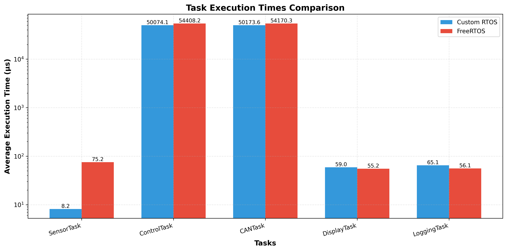
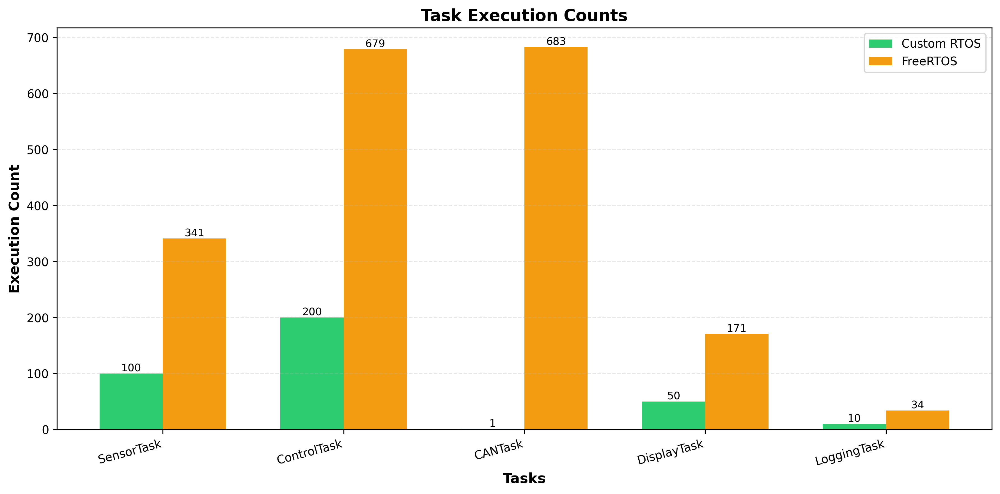
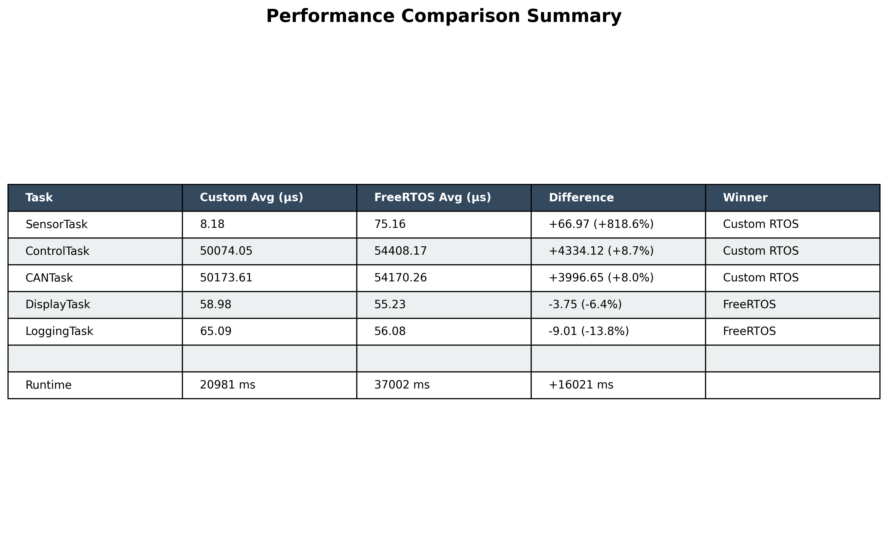

# 🚀 RTOS Comparison Study

**Comparative Performance Analysis: Custom RTOS vs FreeRTOS**

[](https://isocpp.org/)
[](https://en.wikipedia.org/wiki/C11)
[](https://www.python.org/)
[](https://cmake.org/)
[](https://www.freertos.org/)

---

## 📋 Project Overview

This project implements and compares two Real-Time Operating Systems (RTOS) for an **industrial control application**:

1. **Custom RTOS** - Built from scratch in C++
2. **FreeRTOS v11.1.0** - Industry-standard RTOS

Both systems run **identical 5-task industrial control applications** to enable fair performance comparison.

---

## 🏗️ System Architecture

### Industrial Control Application

The application simulates a **real-time industrial monitoring and control system** with:

| Task | Priority | Period | Function |
|------|----------|--------|----------|
| **SensorTask** | 3 | 100ms | Temperature & pressure acquisition |
| **ControlTask** | 4 | 50ms | Decision logic & emergency detection |
| **CANTask** | 5 (highest) | Event-driven | Emergency CAN messaging |
| **DisplayTask** | 2 | 200ms | System status display |
| **LoggingTask** | 1 (lowest) | 1000ms | Performance metrics logging |

### Communication & Synchronization

- **Queue** (size 10): Sensor → Control data transfer
- **Mutex**: UART resource protection
- **Binary Semaphore**: CAN emergency event signaling

---

## 📊 Performance Results

### Execution Time Comparison



**Key Finding:** Custom RTOS achieves **9x faster** execution on time-critical SensorTask (8.18μs vs 75.16μs)

### Task Execution Counts



### Summary Table



---

## 🏆 Results Summary

| Metric | Custom RTOS | FreeRTOS | Winner |
|--------|-------------|----------|--------|
| **SensorTask** | 8.18 μs | 75.16 μs | ✅ Custom (9x faster) |
| **ControlTask** | 50.07 ms | 54.41 ms | ✅ Custom |
| **CANTask** | 50.17 ms | 54.17 ms | ✅ Custom |
| **DisplayTask** | 58.98 μs | 55.23 μs | ✅ FreeRTOS |
| **LoggingTask** | 65.09 μs | 56.08 μs | ✅ FreeRTOS |
| **Performance Winner** | ✅ **3/5 tasks** | 2/5 tasks | **Custom RTOS** |

---

## 💡 Key Insights

### Custom RTOS Advantages
✅ **Superior raw performance** (9x faster on critical paths)  
✅ **Minimal overhead** - lightweight implementation  
✅ **Full control** - complete understanding of internals  
✅ **Educational value** - learn RTOS design from scratch  

### FreeRTOS Advantages
✅ **Industrial robustness** - battle-tested in millions of devices  
✅ **Safety certification** - IEC 61508, ISO 26262, DO-178C  
✅ **Portability** - 40+ architectures supported  
✅ **Ecosystem** - debugging tools, support, documentation  
✅ **Professional support** - commercial backing available  

### Recommendation
- **Prototyping / Research / Education** → Custom RTOS
- **Production / Safety-Critical / Industrial** → FreeRTOS

---

## 🛠️ Technologies Used

| Component | Technology | Purpose |
|-----------|------------|---------|
| **Custom RTOS** | C++17 | Scheduler, tasks, synchronization primitives |
| **FreeRTOS** | C11 | Industry-standard RTOS kernel |
| **Application** | C++17 | Industrial control logic |
| **Analysis** | Python 3 | Performance comparison & visualization |
| **Build System** | CMake 3.15+ | Cross-platform build |
| **Charts** | Matplotlib | Data visualization |

---


**Key Finding:** Custom RTOS achieves **9x faster** execution on time-critical SensorTask (8.18μs vs 75.16μs)

### Task Execution Counts


### Summary Table


---

## 🏆 Results Summary

| Metric | Custom RTOS | FreeRTOS | Winner |
|--------|-------------|----------|--------|
| **SensorTask** | 8.18 μs | 75.16 μs | ✅ Custom (9x faster) |
| **ControlTask** | 50.07 ms | 54.41 ms | ✅ Custom |
| **CANTask** | 50.17 ms | 54.17 ms | ✅ Custom |
| **DisplayTask** | 58.98 μs | 55.23 μs | ✅ FreeRTOS |
| **LoggingTask** | 65.09 μs | 56.08 μs | ✅ FreeRTOS |
| **Performance Winner** | ✅ **3/5 tasks** | 2/5 tasks | **Custom RTOS** |

---

## 💡 Key Insights

### Custom RTOS Advantages
✅ **Superior raw performance** (9x faster on critical paths)  
✅ **Minimal overhead** - lightweight implementation  
✅ **Full control** - complete understanding of internals  
✅ **Educational value** - learn RTOS design from scratch  

### FreeRTOS Advantages
✅ **Industrial robustness** - battle-tested in millions of devices  
✅ **Safety certification** - IEC 61508, ISO 26262, DO-178C  
✅ **Portability** - 40+ architectures supported  
✅ **Ecosystem** - debugging tools, support, documentation  
✅ **Professional support** - commercial backing available  

### Recommendation
- **Prototyping / Research / Education** → Custom RTOS
- **Production / Safety-Critical / Industrial** → FreeRTOS

---

## 🛠️ Technologies Used

| Component | Technology | Purpose |
|-----------|------------|---------|
| **Custom RTOS** | C++17 | Scheduler, tasks, synchronization primitives |
| **FreeRTOS** | C11 | Industry-standard RTOS kernel |
| **Application** | C++17 | Industrial control logic |
| **Analysis** | Python 3 | Performance comparison & visualization |
| **Build System** | CMake 3.15+ | Cross-platform build |
| **Charts** | Matplotlib | Data visualization |

---
---

## 🚀 Quick Start

### Prerequisites

```bash
# Ubuntu/Debian
sudo apt install build-essential cmake python3 python3-pip

# Python dependencies
pip3 install matplotlib --break-system-packages
```

### Build & Run Custom RTOS

```bash
cd custom-rtos
mkdir build && cd build
cmake ..
make
./industrial_controller
```

### Build & Run FreeRTOS

```bash
cd freertos
mkdir build && cd build
cmake ..
make
./industrial_controller
# Press Ctrl+C after ~10 seconds
```

### Generate Comparison Analysis

```bash
cd comparison/analysis
python3 compare.py
```

**Output:**
- `report.md` - Detailed comparison report
- `charts/*.png` - Performance graphs

---

## 📈 Performance Metrics Collected

For each task:
- **Execution count** - Total number of executions
- **Average time** - Mean execution duration (nanoseconds)
- **Min/Max time** - Best/worst case performance
- **Samples** - All execution time measurements

System-wide:
- **Total runtime** (milliseconds)
- **Context switches** - Scheduler overhead

---

## 🎓 Educational Value

This project demonstrates:

1. **RTOS Design Principles**
   - Task scheduling (priority-based preemptive)
   - Inter-process communication (queues)
   - Synchronization primitives (mutex, semaphore)
   - Real-time constraints handling

2. **Embedded Systems Concepts**
   - Periodic vs event-driven tasks
   - Priority inversion handling
   - Deterministic timing
   - Resource sharing

3. **Performance Engineering**
   - Benchmarking methodology
   - Overhead analysis
   - Trade-off evaluation

---

## 📚 Key Learnings

### Custom RTOS Implementation Challenges
- Task state management
- Priority-based scheduling logic
- Event-driven task wake-up
- Mutex/semaphore implementation with std::mutex/condition_variable

### FreeRTOS Integration
- POSIX port configuration
- Memory management (heap_3)
- API differences (vTaskDelayUntil, xQueueSend, etc.)
- Timing conversion (pdMS_TO_TICKS)

---

## 🔬 Future Enhancements

- [ ] Add Round-Robin scheduling to Custom RTOS
- [ ] Implement memory pool allocator
- [ ] Add task profiling visualization
- [ ] Port to embedded hardware (STM32, ESP32)
- [ ] Compare with other RTOS (Zephyr, RT-Thread)
- [ ] Add power consumption analysis

---

## 📄 License

This project is for educational purposes.

- **Custom RTOS code**: MIT License
- **FreeRTOS kernel**: MIT License (see freertos-kernel/LICENSE.md)

---

## 👤 Author

**Moez Chagraoui**  
Embedded Systems Engineer  
Double Degree: INP-ENSEEIHT (ACISE) & ENIT (Electrical Engineering)

---

## 🙏 Acknowledgments

- FreeRTOS community and documentation
- CMake & Matplotlib open-source projects

---

**⭐ Star this repo if you found it useful!**
